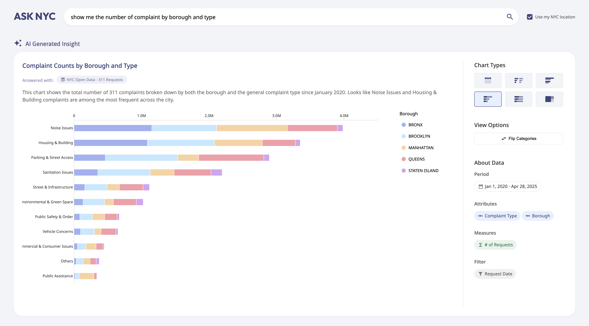

# 🗽 ASK NYC: NYC Open Data Explorer

This is the GitHub repository for ASK NYC – NYC Data Explorer, a natural language interface for exploring New York City’s 311 service requests.

This project was developed as part of a 2025 thesis for the M.S. in Data Visualization program at Parsons School of Design. 
- 🌐 [Application URL](https://takumanken.github.io/thesis/application/frontend/index.html)
- ✍️ [Thesis Paper](https://github.com/takumanken/thesis/blob/main/A%20Natural%20Language%20Interface%20for%20Exploring%20NYC%20Open%20Data_%20Enhancing%20Public%20Access%20to%20Data.pdf)
- 📹 [Demo Video](https://drive.google.com/file/d/1SkV6AFB3EMg4uR__qWwvjVxzxlrXK5dw/view)

## How to Use

### Top Page

Upon landing on ASK NYC, you’ll encounter a clean, search-engine–style interface featuring:

| Element                           | Purpose                                                                                                                                                                                           |
| --------------------------------- | ------------------------------------------------------------------------------------------------------------------------------------------------------------------------------------------------- |
| **Search bar**                    | Type a plain-English question about the NYC 311 dataset (e.g., “What are the most common complaint types in Brooklyn?”) and press Enter.|
| **“What can you answer?” button** | Displays a sample query explaining how to use the system.|
| **“Surprise Me!” button**         | Autofills the search bar with a random example to encourage exploration, even if you're unfamiliar with the dataset’s structure. |
| **Use my NYC Location** | When enabled, supports location-specific queries such as “Where are the rat hotspots around me?” using your approximate location. |

### Application Page

After submitting a question, you're taken to the main application workspace, which includes five key sections:
| Section                         | Description                                                                                                                 |
|---------------------------------|-----------------------------------------------------------------------------------------------------------------------------|
| **Search Section (top)**        | Submit follow-up questions or refine your current query.                                                                   |
| **Title & Insight Panel**       | Displays an AI-generated headline and summary, along with metadata on the dataset used.                                    |
| **Visualization Canvas (center)** | Shows a chart selected to best match your query. Hover over elements for tooltips or zoom in on maps.                    |
| **Chart Controls (right sidebar, upper)** | Switch chart types (when applicable) and toggle between data categories.                                      |
| **About the Data (right sidebar, lower)** | Provides details on time span, dimensions, measures, and filters for full transparency.                     |

## Datasets Used
| Data Source                           | Description                                                                                                                                                                                          |
| --------------------------------- | ------------------------------------------------------------------------------------------------------------------------------------------------------------------------------------------------- |
| [**NYC Open Data - 311 Requests**](https://data.cityofnewyork.us/Social-Services/311-Service-Requests-from-2010-to-Present/erm2-nwe9/about_data) | Includes details on service requests submitted to NYC's 311 system. This application currently uses data from January 2020 through April 2025.|
| [**NYC Open Data - NTA Polygons**](https://data.cityofnewyork.us/City-Government/2020-Neighborhood-Tabulation-Areas-NTAs-/9nt8-h7nd/about_data) | Geospatial data defining boundaries, names, and types of Neighborhood Tabulation Areas (NTAs).|
| [**NYC Open Data - Zip Code Polygons**](https://data.cityofnewyork.us/Health/Modified-Zip-Code-Tabulation-Areas-MODZCTA-/pri4-ifjk/about_data) | Geospatial data for Modified Zip Code Tabulation Areas (MODZCTA), including boundary definitions.|
| [**NYC Department City Planning - NYC 2020 Census Data**](https://www.nyc.gov/content/planning/pages/resources/datasets/decennial-census) | Includes demographic and housing data.Note: Only 2020 population data at the NTA level is used; no other demographic details or finer granularity are included.|

## Privacy Notice

By using ASK NYC you agree that:

- **Query Processing**: All queries entered are processed through Google's Gemini API to create data visualizations. Because this site uses the free Gemini tier, Google may retain prompts and outputs to improve its services. See [Google's AI terms](https://ai.google.dev/terms) for more details.

- **Location Data**: If you enable "Use my NYC location," your coarse latitude/longitude (3-decimal places, approximately 111m accuracy) will be sent to our servers. This information is used solely to retrieve relevant local data.

- **Connection Logs**: GitHub Pages (site host) and Railway (API host) automatically log connection metadata such as IP addresses for security purposes. For details, see [GitHub Pages documentation](https://docs.github.com/en/pages/getting-started-with-github-pages/what-is-github-pages#data-collection) and [Railway's privacy policy](https://railway.com/legal/privacy).

- **Internal Logs**: We maintain brief internal diagnostics logs (timestamp + query/result) purely for troubleshooting purposes. These logs auto-delete on routine rotation and are never shared with third parties.

Please refrain from submitting sensitive or personally identifiable information through your queries.

## AI Model
This project uses [Gemini 2.5 Flash](https://cloud.google.com/vertex-ai/generative-ai/docs/models/gemini/2-5-flash) as of May 14, 2025.

## Special Thanks
- **Daniel Sauter** – Thesis Advisor and Professor
- All my wonderful classmates in the M.S. in Data Visualization program

## 📄 License

MIT © 2025 Tak Watanabe

