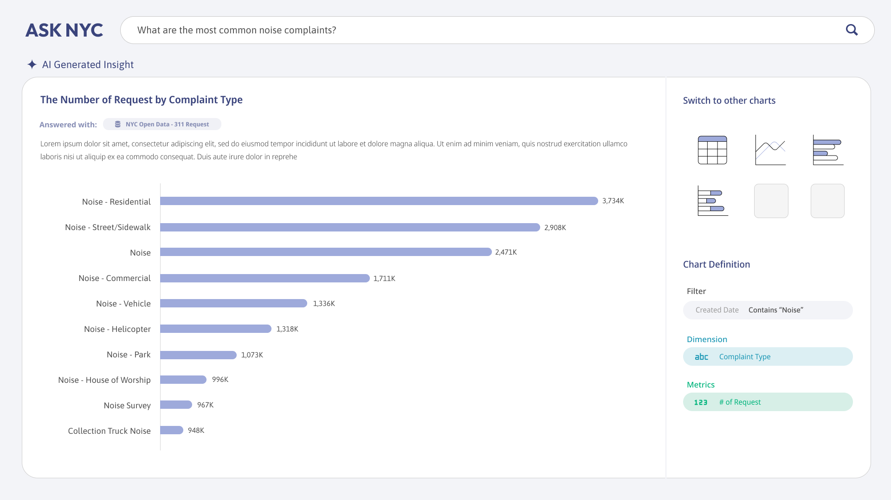

# Design Mockup

## Cover Page

## Main Page
The main page dynamically generates charts to visualize data based on the user's query, optimizing the representation for different types of analysis:
- **Line Chart** for trend analysis (e.g., complaints over time).  
- **Bar Chart** for comparisons (e.g., number of 311 requiests by complaint type).  
- **Scatterplot** for illustrating relationships between variables.

On the right side of the screen:  
- **Chart Switcher** enables users to easily switch between different types of visualizations.  
- **Chart Definition** provides details on the aggregation conditions, including:  
  - Applied **filters** (e.g., date range).  
  - Selected **dimensions** (e.g., time and borough).  
  - Chosen **metrics** (e.g., number of complaints).  

If an user asks the question which open data cannot answer, the general result provided by gemini is returned with the source.

# Architecture
This system consists of three main components:

- Front-End – Captures user queries, processes inputs, and displays the final visualization.

- Back-End – Interacts with Google AI Studio to determine the appropriate chart type, define data aggregation, and execute generated queries in DuckDB (an open-source in-memory database). It runs on AWS Lambda within free tiers.

- Google AI Studio – Utilizes the latest Gemini model within free tiers to optimize chart selection and query processing.

